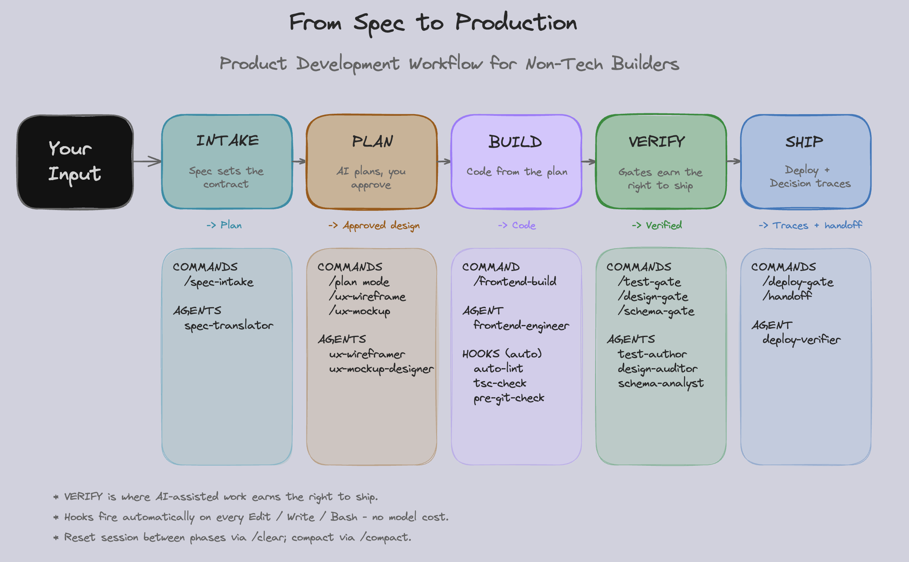

# Founder Stack

**Engineering workflow for non-technical founders shipping real products with Claude Code.**

This is the workflow used to take a real SaaS from blank repo to deployed beta in 13 days, solo, without writing a line of code by hand. It's opinionated, gate-driven, and refuses to let you skip the parts that matter.

<p align="center">
  
</p>

> The five stages each list the commands and agents that run inside them. Diamonds are gates — shell-enforced checkpoints the agent cannot talk past. Full version with stage-by-stage detail in [`docs/workflow.md`](docs/workflow.md).


## What's in here

- **The Workflow (v0.1, stable)** — `Engineering-Playbook.md` plus 15 slash commands, 8 subagents, and 5 shell hooks that enforce a build cycle: intake → (challenge) → (design) → plan → execute → verify → ship. The optional `design` layer (`/ux-wireframe` → `/ux-mockup` with human approval) lands designs as a source of truth before frontend code is written; `/frontend-build` then converts the approved design into a brief + scaffold the main agent implements against (hard-gated on the approval marker).
- **Autonomous Missions (v1 preview)** — `/mission` scopes a goal, writes a validation contract for your approval, then dispatches a feature-worker (sonnet), scrutiny-validator (sonnet), and v0.1 auditors on a `/loop` tick — designed for overnight runs. Each mission runs in its own `git worktree` for filesystem isolation. Orchestration logic runs in your main agent thread (Opus recommended) — sub-agent nesting is blocked by Claude Code, so the slash commands execute procedure files directly rather than dispatching a meta-orchestrator agent. See [`docs/missions.md`](docs/missions.md).
- **Skills** — optional reasoning packs (decision traces, war cabinet, grill, zoom-out).
- **Templates** — parameterized `CLAUDE.md` and `project.json` for new projects.
- **Init script** — interactive setup that asks 6 questions and writes your project config.


## Quickstart (60 seconds)

```bash
git clone https://github.com/rajconnects/founder-stack ~/founder-stack
cd your-new-project
git init   # if not already a repo
~/founder-stack/scripts/install.sh
~/founder-stack/scripts/init-project.sh
```

`install.sh` symlinks the workflow into your project's `.claude/` and wires the framework's hooks into `.claude/settings.json` automatically. `init-project.sh` walks you through generating a `project.json` and a starter `CLAUDE.md`.

Open Claude Code in that directory and try `/spec-intake` to begin.

> Installing into an existing repo, or one that already has another harness or global commands? Read [`docs/install.md`](docs/install.md) — it covers the three deploy scenarios and what to consider for each.

## Two ways to drive

| Mode | Command | When |
|---|---|---|
| **Control mode** (v0.1, default) | `/spec-intake` → `/test-gate` → `/design-gate` → `/handoff` | You drive each gate. Hands-on, safety-net through process. Right when you're new to the framework, or when scope is exploratory. |
| **Autonomous mode** (v1 preview) | `/mission "<goal>"` → `/loop /mission-tick <id>` | The `/mission*` slash commands run an orchestration procedure in your main agent thread: scope the goal with you, write a validation contract for your approval, then dispatch workers and validators on a `/loop` tick until done. Right for overnight runs on crisp, well-scoped features. **Run on Opus** — orchestration logic inherits your session model, and the planning/retry passes are noticeably weaker on Sonnet. |

Both modes coexist — install v1 additively on top of v0.1 with `~/founder-stack/scripts/install-v1.sh`. v1 reuses v0.1's gates internally — the tick procedure dispatches `design-auditor` and `schema-analyst` in parallel with `scrutiny-validator` when applicable, so there's one source of truth per check.

## Why "for non-technical founders"?

Most agentic-coding tutorials assume you can read the diff and tell when the agent is bullshitting. Non-technical founders can't — so they need *process* instead of *judgment* as the safety net. Gates, traces, and single-track days are how you ship without the codebase rotting.

[Read the framing essay →](docs/for-non-tech-founders.md)

## Editor support

V1 ships **Claude Code-first**. The primitives (slash commands, subagents, hooks) are Claude Code-native. Cursor/Copilot/Pi don't have first-class equivalents; ports lose the enforcement layer. A Cursor rules-only pack may follow if there's demand.

## Inspiration & credit

Heavily inspired by [mattpocock/skills](https://github.com/mattpocock/skills). Founder Stack adds the *workflow* layer (gates, coordination, traces, handoffs) on top of the skills idea, framed for non-technical founders.

## License

MIT
