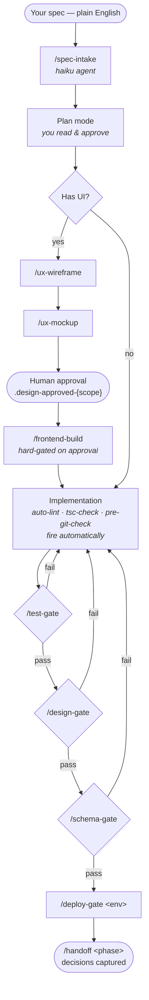

# The Workflow — Five-Layer Build Cycle

Each phase of work passes through five layers. Skipping a layer is how codebases rot.

## At a glance

Diamonds are gates — shell-enforced checkpoints the agent cannot talk past. The verify gates run only when relevant: skip `/design-gate` if the change has no UI, `/schema-gate` if there's no migration. The design ladder (`/ux-wireframe` → `/ux-mockup` → human approval) is layer 1.7 — optional but required when UI is involved, because `/frontend-build` is hard-gated on the `.design-approved-{scope}` marker.

## Layer 1 — Intake

`/spec-intake <spec-file>`

A spec is a plain-English description of what you want built. The intake command (powered by the `spec-translator` subagent) parses it into a structured execution plan: file paths, dependency order, gate checkpoints.

**Output:** a plan object in your conversation, ready to approve or push back on.

## Layer 2 — Plan

Built-in plan mode in Claude Code.

You read the plan. Push back on what's wrong. Approve when right.

**Rule:** never let implementation start before you've actually read the plan. The 30 seconds of friction here saves hours of unwinding later.

## Layer 3 — Execute

Implementation, with three shell hooks running automatically:

- `auto-lint.sh` — on every file save
- `tsc-check.sh` — on every TypeScript change
- `pre-git-check.sh` — before every commit

Hooks are how the framework makes implementation safe without requiring you to read the diff. They block bad code from making it to git.

## Layer 4 — Verify

The gates. Three of them, run in order as relevant:

- `/test-gate <feature>` — were the tests written *first*? Do they actually establish the contract?
- `/design-gate <scope>` — does the implemented UI match the design tokens, spec, and (if Figma is connected) the design file?
- `/schema-gate <migration>` — is the migration additive-only, RLS-covered, reversible? Read-only DB checks confirm assumptions.

A failing gate blocks the next layer. The agent can't talk past them — they're shell scripts.

## Layer 5 — Ship

`/deploy-gate <env>` — post-deploy smoke check (health endpoint, Playwright critical path, log scan).

`/handoff <phase>` — generates a handoff doc, prompts decision-trace capture, closes the phase.

The handoff is what the *next* phase reads first. It's how single-track days stay single-track.

## Cross-cutting: session hygiene

The five layers describe *what* runs at each stage. **Session hygiene** is the habit you apply *between* layer transitions — when to reset the conversation (Claude Code: `/clear`), when to compact it (`/compact`), and when to leave it alone.

A natural rhythm: compact after intake converges; keep the session through implementation and tests; reset after a gate PASSes if the next task is unrelated; reset after `/handoff`. The gate commands now print a session-reset hint on PASS so the seam is hard to miss.

Per-call cost is addressed by model tiers and tool-surface trimming (see `CHANGELOG.md` 2026-05-05). Cross-call cost is addressed here. Both matter — and a long-running Opus orchestrator dragging hours of stale context is *worse* at the next task, not just more expensive.

Full guidance: [`docs/session-hygiene.md`](session-hygiene.md).

## Reuse, not rebuild

Don't reinvent the cycle for each phase. The same five layers carry every feature, every bug fix, every migration. The discipline is the discipline.
